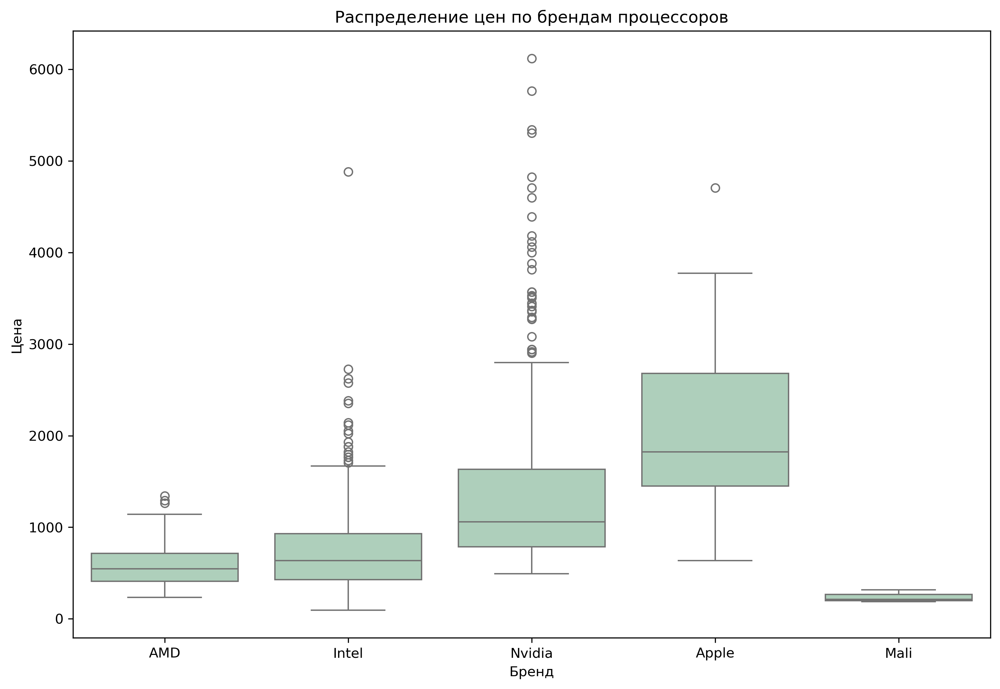

# Laptops Price Analysis

## Цель анализа
Проанализировать данные о ноутбуках, чтобы понять, какие характеристики влияют на цену.  
Проверить гипотезы о зависимости цены от различных факторов.

## Данные
Использован датасет с Kaggle:  
[Laptop Price and Specification Dataset](https://www.kaggle.com/datasets/sumanbera19/laptop-price-dataset/data)

## Проверяемые гипотезы
- Влияет ли тип видеокарты (встроенная/дискретная) на цену?
- Отличаются ли цены ноутбуков с процессорами 13th Gen Intel Core i7 13700H и 7th Gen AMD Ryzen 7 7840HS?
- Влияет ли разрешение экрана монитора на цену?
- Стоят ли ноутбуки с рейтингом выше 70 дороже, чем ноутбуки с более низким рейтингом?
- Стоят ли ноутбуки с видеокартами NVIDIA дороже, чем ноутбуки с видеокартами Intel или AMD?

## Методы анализа
- Проверка нормальности распределения (Shapiro-Wilk test)
- Сравнение групп (Kruskal-Wallis test, Mann-Whitney U test)
- Корреляционный анализ
- Визуализация с помощью seaborn и matplotlib (boxplot, violinplot, barplot и др.)

## Предобработка данных

Предварительно была проведена небольшая очистка данных для удаления пропусков и аномалий, что позволило повысить качество и достоверность анализа.

Полный ноутбук с кодом и анализом доступен в файле [`laptops_analysis_.ipynb`](./laptops_analysis_.ipynb) — в этом документе приведены только ключевые фрагменты кода и результаты.

---

## Анализ и интерпретация результатов

Ниже приведены основные графики и выводы по проверяемым гипотезам.

## Распределение цены

Распределение имеет асимметричный вид (положительная асимметрия): большинство значений концентрируется в левой части графика (низкие цены), а длинный хвост растянут вправо (высокие цены). Такое распределение говорит о преобладании бюджетных и средних ноутбуков на рынке.

- Мода равна 823 долларам, что указывает на наиболее популярные ноутбуки — доступные большинству потребителей, используемые для базовых задач: офис, интернет, учеба.
- Медиана равна 765 долларам, подтверждая наличие значительного количества бюджетных предложений.
- Среднее значение равно 993 долларам, что выше медианы из-за влияния более дорогих моделей.
- Длинный правый хвост свидетельствует о присутствии премиальных ноутбуков (игровые, профессиональные), которые встречаются редко, но существенно влияют на среднюю цену.

## Распределение цены на самые популярные бренды

### HP  
Основной сегмент — до 1200 $. Однако есть много выбросов от 2000+ $, которые представляют топовые игровые (Omen, Spectre) и профессиональные модели (ZBook).

### Lenovo  
50% устройств стоят до 600 $, 75% — до 1000 $. Цены сдвинуты в сторону недорогих моделей, ориентированных на массовый рынок. Выбросы доходят до 5000 $ (ThinkPad X1, Legion, Yoga).

### Samsung  
Ценовой диапазон смещён в средне-высокий сегмент: 50% моделей дороже 1500 $, 75% — до 1700 $. Нижняя граница — 900 $, без выбросов, что говорит о стабильной ценовой политике.

### Apple  
Цены сосредоточены в премиум-сегменте: 50% моделей от 1700 до 2700 $, медиана около 1900 $. Один выброс — MacBook Pro 16 2023 (~5000 $). В целом узкий ценовой разброс без бюджетных вариантов.

### Asus  
Основной сегмент — 500–900 $, медиана около 800 $. Выбросы 1500–1900 $ включают Vivobook, Zenbook, TUF и ROG, а также редкие выбросы до 3500–3900 $ — топовые игровые модели.

### Dell  
Основная масса — 500–1100 $, медиана чуть выше 800 $. Выбросы 2100–5500 $ — игровые ноутбуки, показывающие широкий ценовой диапазон.

### Acer  
Основной сегмент — 500–700 $, медиана около 600 $. Выбросы 1200–2200 $ — продвинутые и игровые модели. В целом бюджетный бренд с ограниченным числом премиальных устройств.

### Infinix  
Цены узко сосредоточены в бюджете: 500–600 $, медиана около 550 $, без выбросов — чёткое позиционирование на недорогие модели.

### Chuwi  
Очень бюджетный сегмент: 1-й квартиль 400 $, 3-й — 500 $, медиана 450 $, без выбросов.

### MSI  
Широкий ценовой разброс: основная масса — 700–2000 $, медиана около 1100 $. Есть значительные выбросы выше 4000 $ — мощные игровые и профессиональные ноутбуки.

---

