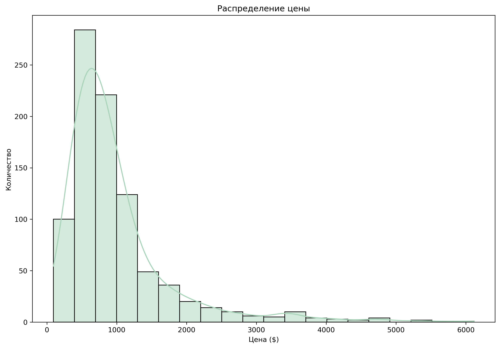

# Laptops Price Analysis

## Цель анализа
Проанализировать данные о ноутбуках, чтобы понять, какие характеристики влияют на цену.  
Проверить гипотезы о зависимости цены от различных факторов.

## Данные
Использован датасет с Kaggle:  
[Laptop Price and Specification Dataset](https://www.kaggle.com/datasets/sumanbera19/laptop-price-dataset/data)

## Проверяемые гипотезы
- Влияет ли тип видеокарты (встроенная/дискретная) на цену?
- Отличаются ли цены ноутбуков с процессорами 13th Gen Intel Core i7 13700H и 7th Gen AMD Ryzen 7 7840HS?
- Влияет ли разрешение экрана монитора на цену?
- Стоят ли ноутбуки с рейтингом выше 70 дороже, чем ноутбуки с более низким рейтингом?
- Стоят ли ноутбуки с видеокартами NVIDIA дороже, чем ноутбуки с видеокартами Intel или AMD?

## Методы анализа
- Проверка нормальности распределения (Shapiro-Wilk test)
- Сравнение групп (Kruskal-Wallis test, Mann-Whitney U test)
- Корреляционный анализ
- Визуализация с помощью seaborn и matplotlib (boxplot, violinplot, barplot и др.)

## Предобработка данных

Предварительно была проведена небольшая очистка данных для удаления пропусков и аномалий, что позволило повысить качество и достоверность анализа.

Полный ноутбук с кодом и анализом доступен в файле [`laptops_analysis_.ipynb`](./laptops_analysis_.ipynb) — в этом документе приведены только ключевые фрагменты кода и результаты.

---

## Анализ и интерпретация результатов

Ниже приведены основные графики и выводы по проверяемым гипотезам.

## Распределение цены



Распределение имеет асимметричный вид (положительная асимметрия): большинство значений концентрируется в левой части графика (низкие цены), а длинный хвост растянут вправо (высокие цены). Такое распределение говорит о преобладании бюджетных и средних ноутбуков на рынке.

- Мода равна 823 долларам, что указывает на наиболее популярные ноутбуки — доступные большинству потребителей, используемые для базовых задач: офис, интернет, учеба.
- Медиана равна 765 долларам, подтверждая наличие значительного количества бюджетных предложений.
- Среднее значение равно 993 долларам, что выше медианы из-за влияния более дорогих моделей.
- Длинный правый хвост свидетельствует о присутствии премиальных ноутбуков (игровые, профессиональные), которые встречаются редко, но существенно влияют на среднюю цену.


## Распределение цены на самые популярные бренды


### HP  
Основной сегмент — до 1200 $. Однако есть много выбросов от 2000+ $, которые представляют топовые игровые (Omen, Spectre) и профессиональные модели (ZBook).

### Lenovo  
50% устройств стоят до 600 $, 75% — до 1000 $. Цены сдвинуты в сторону недорогих моделей, ориентированных на массовый рынок. Выбросы доходят до 5000 $ (ThinkPad X1, Legion, Yoga).

### Samsung  
Ценовой диапазон смещён в средне-высокий сегмент: 50% моделей дороже 1500 $, 75% — до 1700 $. Нижняя граница — 900 $, без выбросов, что говорит о стабильной ценовой политике.

### Apple  
Цены сосредоточены в премиум-сегменте: 50% моделей от 1700 до 2700 $, медиана около 1900 $. Один выброс — MacBook Pro 16 2023 (~5000 $). В целом узкий ценовой разброс без бюджетных вариантов.

### Asus  
Основной сегмент — 500–900 $, медиана около 800 $. Выбросы 1500–1900 $ включают Vivobook, Zenbook, TUF и ROG, а также редкие выбросы до 3500–3900 $ — топовые игровые модели.

### Dell  
Основная масса — 500–1100 $, медиана чуть выше 800 $. Выбросы 2100–5500 $ — игровые ноутбуки, показывающие широкий ценовой диапазон.

### Acer  
Основной сегмент — 500–700 $, медиана около 600 $. Выбросы 1200–2200 $ — продвинутые и игровые модели. В целом бюджетный бренд с ограниченным числом премиальных устройств.

### Infinix  
Цены узко сосредоточены в бюджете: 500–600 $, медиана около 550 $, без выбросов — чёткое позиционирование на недорогие модели.

### Chuwi  
Очень бюджетный сегмент: 1-й квартиль 400 $, 3-й — 500 $, медиана 450 $, без выбросов.

### MSI  
Широкий ценовой разброс: основная масса — 700–2000 $, медиана около 1100 $. Есть значительные выбросы выше 4000 $ — мощные игровые и профессиональные ноутбуки.

## Средняя оценка по брендам


График показывает значительную разницу в средних оценках между брендами ноутбуков. Лидерами являются **Ninkear** (73.0), **HP** и **Colorful** (около 70.0), в то время как **Microsoft** (54.5), **Honor** (55.0) и **Infinix** (55.21) получили самые низкие оценки.

## Цена по операционной системе и распределение моделей по ОС


- **Windows 11** имеет много выбросов в верхней части распределения, так как почти все новые ноутбуки оснащаются этой ОС. Это приводит к широкому диапазону цен — от бюджетных моделей до дорогих устройств.  
- **Windows 10** используется всё реже и распределение цен для неё более компактное, в среднем ценовом диапазоне.  
- **Mac OS** демонстрирует высокие цены с медианой около 2000 долларов и длинными «усами» до 4000 долларов, что отражает статус Apple как производителя премиальных устройств.  
- **DOS OS** и **Chrome OS** имеют низкие цены и ограниченное использование, объясняющееся низким спросом.  

В целом, рынок ноутбуков чётко разделён: Windows 11 доминирует среди новых устройств, Mac OS занимает премиальный сегмент, а DOS OS и Chrome OS остаются на периферии из-за низкого спроса.

## Топ 10 процессоров по среднему рейтингу


График демонстрирует сравнение производительности различных процессоров на основе их среднего рейтинга.

- **13th Gen Intel Core i7 13700HX** занимает первое место с самым высоким рейтингом — 79.0, что указывает на его превосходные характеристики и популярность среди пользователей.  
- Второе место разделяют **13th Gen Intel Core i9 13900HX** и **7th Gen AMD Ryzen 7 7735U**, оба с рейтингом 75.0.  
- Далее идут процессоры: **6th Gen AMD Ryzen 9 6900HS** (рейтинг 74.5) и **12th Gen Intel Core i7 12700H** (рейтинг 73.5), показывающие высокие показатели.  
- Остальные процессоры имеют рейтинги в диапазоне от 71.8 до 79.0, демонстрируя небольшие различия в производительности.

## Зависимость цены от RAM


График показывает, что цена ноутбука растет с увеличением объема оперативной памяти (RAM). 

- Наиболее дорогие модели оснащены 64 ГБ LPDDR5X RAM, достигая цен около 5000 долларов.
- Устройства с минимальным объемом RAM (2 ГБ DDR3) стоят значительно меньше — примерно 100 долларов.

Это демонстрирует прямую корреляцию между объемом RAM и ценой: чем больше оперативной памяти, тем выше стоимость ноутбука.

## Зависимость цены от SSD


Здесь наблюдается схожая тенденция, как и в случае с оперативной памятью (RAM): чем больше объем SSD-накопителя, тем выше цена ноутбука.

Это подтверждает, что емкость хранения данных также является важным фактором, влияющим на стоимость устройства.

## Распределение размеров экрана


График показывает, что наиболее популярные размеры экранов ноутбуков находятся в диапазоне **14–16 дюймов**.  
Меньшие экраны (меньше 13 дюймов) и большие экраны (больше 17 дюймов) встречаются значительно реже.

Это указывает на то, что потребители предпочитают **ноутбуки среднего размера**, обеспечивающие баланс между **портативностью** и **удобством использования** — для офиса, учёбы и развлечений.

## Зависимость цены от разрешения экрана


Разрешения **Full HD** и **HD** сосредоточены в более низком ценовом диапазоне (до **1000–2000 долларов**), тогда как **2K/QHD**, **3K+**, и особенно **4K** имеют значительно более высокие цены (до **6000–7000 долларов**). График также показывает, что **4K-дисплеи** имеют **широкий диапазон цен**, что указывает на наличие как доступных решений, так и **премиальных моделей**. 

Это подчёркивает, что **высокое разрешение экрана** является значительным фактором, влияющим на стоимость ноутбука.

## Распределение цены по видеокартам


График показывает **распределение цен ноутбуков с 10 самыми популярными видеокартами**.

## Распределение цены в зависимости от гарантийного срока


На графике видно, что **медианная цена ноутбуков увеличивается с ростом гарантийного срока**. Это демонстрирует, что **более длительная гарантия чаще предоставляется на дорогие и премиальные модели**, в то время как **бюджетные устройства** обычно сопровождаются **1-летней гарантией**.

1 год остаётся самой популярной опцией, охватывающей основную часть моделей — это говорит о **массовом сегменте**, где производители ограничивают обязательства, сохраняя при этом минимальные стандарты. Напротив, устройства с 2–3 годами гарантии чаще относятся к **высшему ценовому диапазону**, отражая уверенность брендов в качестве сборки и долговечности своих устройств.

## Корреляционный анализ


Тепловая диаграмма корреляций показывает, что **цена ноутбука (`Price`) имеет сильную положительную корреляцию с объемом оперативной памяти (`Ram_int`, коэффициент 0.78)** и **размером SSD (`SSD_int`, коэффициент 0.68)**. Это подтверждает, что технические характеристики являются основными драйверами цены.

Также можно отметить **умеренную корреляцию между RAM и SSD** (коэффициент 0.66), что логично: более мощные ноутбуки, как правило, комплектуются одновременно большим объемом оперативной памяти и емкими накопителями.

**Гарантийный срок (`Warranty_int`)**, **размер экрана (`Screen_Size`)** и **рейтинг (`Rating`)** демонстрируют слабую или почти нулевую корреляцию с ценой, что указывает на их меньшую значимость при формировании стоимости устройства.

## Гипотеза 1: Влияет ли тип видеокарты (встроенная/дискретная) на цену?

**H₀:** Тип видеокарты не влияет на цену ноутбука  
**H₁:** Ноутбуки с дискретной графикой имеют более высокую цену, чем с интегрированной

### Визуализация

- Violin-график показывает, что ноутбуки с `dedicated` GPU стоят дороже, чем с `integrated`.
- Распределение цен также подтверждает, что `dedicated` видеокарты характерны для более дорогих устройств.

  


---

### Проверка нормальности (Shapiro-Wilk)

```python
for gpu_type in df['GPU_type'].unique():
    stat, p = stats.shapiro(df[df['GPU_type'] == gpu_type]['Price'])
    print(f'{gpu_type} - p-value:', p)


## Результаты:

- **dedicated** - p-value: 2.51e-24  
- **integrated** - p-value: 1.28e-23

→ Распределения не нормальны, применим непараметрический тест Манна–Уитни.

### 🧪 Mann–Whitney U-тест

```python
price_integrated = df[df['GPU_type'] == 'integrated']['Price']
price_dedicated = df[df['GPU_type'] == 'dedicated']['Price']
stat, p = stats.mannwhitneyu(price_integrated, price_dedicated, alternative='two-sided')
print('p-value:', p)


## Результат:

p-value: 6.12e-33

## Вывод:

Тип видеокарты влияет на цену ноутбука: ноутбуки с дискретной графикой стоят статистически значимо дороже, чем с интегрированной.


